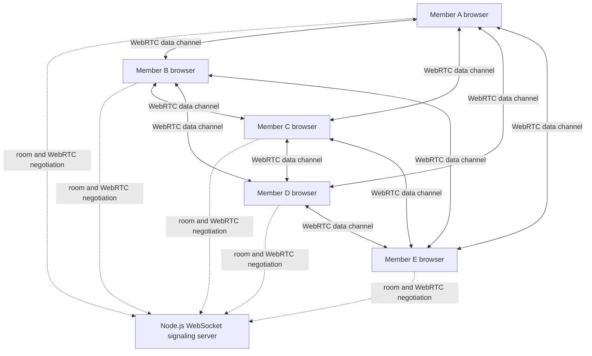

# PeerShare

> Direct, browser-to-browser file sharing without uploading files to a central storage service.

PeerShare is a WebRTC-based peer-to-peer file-transfer application. A user creates a temporary room, shares its code, and connects up to four additional members. Every member can upload a file, and every connected member receives an independently verified download.

The project is designed around a simple architectural principle:

> **The server helps browsers find each other; the browsers transfer the file directly.**

[](./client) [](./client) [](https://webrtc.org/) [](./server)

---

## Table of contents

- [Problem](#problem)
- [Solution](#solution)
- [Features](#features)
- [Architecture](#architecture)
- [Transfer lifecycle](#transfer-lifecycle)
- [Connectivity modes](#connectivity-modes)
- [Technology stack](#technology-stack)
- [Repository structure](#repository-structure)
- [Run locally](#run-locally)
- [Deploy](#deploy)
- [Configuration](#configuration)
- [Security and privacy](#security-and-privacy)
- [Known limitations](#known-limitations)
- [Development commands](#development-commands)

## Problem

Traditional file-sharing applications usually require a file to be uploaded to a central server before another person can download it. That approach creates several problems:

- Large files consume server storage and bandwidth.
- Uploading and downloading the same file adds unnecessary latency.
- Users must trust a third party with private file contents.
- File sharing becomes difficult when devices are on a local network without internet access.
- A room with several participants needs more than a simple one-to-one transfer flow.

PeerShare addresses these problems without pretending that a browser can connect two completely isolated devices magically. Devices still need a way to discover one another: either a local network, a hotspot, or an internet-connected signaling service.

## Solution

PeerShare divides communication into two separate planes:

1. **Signaling plane** — a lightweight Node.js WebSocket service creates rooms and forwards WebRTC negotiation messages.
2. **Data plane** — WebRTC `RTCDataChannel` connections carry file metadata and binary chunks directly between browsers.

The signaling service does not receive, store, or stream the file. Once the peers connect, file data bypasses the server.

## Features

- Temporary rooms with a maximum of five members.
- Any member can upload files.
- Each upload is sent to every currently connected member.
- Each member receives a separate download link after verification.
- Browser-to-browser transfer using WebRTC data channels.
- Works on the same Wi-Fi even when that network has no internet access.
- Supports cross-network connections when internet connectivity and ICE traversal permit it.
- 64 KiB chunking for large files.
- Backpressure using `RTCDataChannel.bufferedAmount` to avoid overwhelming browser memory.
- SHA-256 integrity verification before a download is offered.
- No permanent file storage or database required.
- Responsive interface for desktop and mobile browsers.

## Architecture



### Why a mesh?

For a small room, a full mesh is straightforward and keeps the server out of the file path. With five members, each browser maintains up to four peer connections. When a member uploads a file, that browser sends the chunks once over each open connection.

This is intentionally scoped for small rooms. A much larger room should use an SFU or another server-assisted media architecture; a mesh does not scale efficiently because the number of connections grows approximately as $n(n-1)/2$.

## Transfer lifecycle

1. A browser opens a WebSocket connection to the signaling server.
2. A member creates a room, or joins an existing room with its code.
3. The server returns the existing peer IDs and notifies current members of the new member.
4. Browsers create targeted WebRTC offers, answers, and ICE-candidate messages.
5. Each `RTCDataChannel` opens directly between two browsers.
6. The sender calculates a SHA-256 hash and sends file metadata.
7. The file is sliced into 64 KiB `ArrayBuffer` chunks.
8. Chunks are paused when the channel buffer is high and resumed when it drains.
9. The sender sends a completion message to every peer.
10. Each receiver reconstructs its own `Blob`, calculates SHA-256, and exposes a download only when the hashes match.

Example control messages sent through the data channel:

```json
{
  "type": "file-start",
  "transferId": "unique-transfer-id",
  "metadata": {
    "name": "report.pdf",
    "size": 465123,
    "type": "application/pdf",
    "hash": "sha256-hex-digest"
  }
}
```

Binary chunks are sent as data-channel messages. The signaling server sees only room and negotiation messages; it never receives these binary chunks.

## Connectivity modes

### Same Wi-Fi, no internet

This is supported. Connect both devices to the same router or phone hotspot, run the app from the host computer's LAN IP, and keep the local signaling server running. The WebRTC connection can use local candidates without an internet connection.

Some guest networks disable device-to-device traffic. In that case, use a normal private network or hotspot and allow Node.js through the Windows private-network firewall.

### Different networks with internet

The application includes a public STUN server to help browsers discover reachable network addresses. STUN is not a relay and cannot guarantee connectivity through restrictive NATs or corporate firewalls.

For reliable production connectivity, configure a TURN server and add its credentials to the WebRTC `iceServers` configuration.

### Completely disconnected devices

Two devices on unrelated networks with no internet or shared local network cannot discover each other through a website. This is a network constraint, not an application setting. They need a shared hotspot/router or a different offline transport such as Bluetooth, Wi-Fi Direct, or a native application.

## Technology stack

| Layer | Technology | Responsibility |
| --- | --- | --- |
| User interface | React + TypeScript | Room, member, file, progress, and download UI |
| Frontend build | Vite | Development server and production bundle |
| Signaling | Node.js + `ws` | Room membership and targeted WebRTC signaling |
| Peer transport | WebRTC `RTCPeerConnection` | Direct browser-to-browser connections |
| File transport | WebRTC `RTCDataChannel` | Metadata and binary file chunks |
| Integrity | SHA-256 via `js-sha256` | Verify reconstructed files in mobile and desktop contexts |
| Frontend hosting | GitHub Pages | Static production frontend |
| Signaling hosting | Render/Railway/Fly.io/VPS | Persistent WebSocket service |

## Repository structure

```text
Peer2Peer/
├── client/
│   ├── src/
│   │   ├── App.tsx          # Room, WebRTC mesh, transfer protocol, and UI
│   │   ├── App.css          # Application styles
│   │   └── main.tsx         # React entry point
│   ├── .env.example         # Frontend configuration template
│   ├── package.json
│   └── vite.config.ts
├── server/
│   ├── src/server.ts        # WebSocket signaling service
│   ├── package.json
│   └── tsconfig.json
├── .github/workflows/
│   └── deploy-pages.yml     # GitHub Pages deployment
├── render.yaml              # Render service definition
└── README.md
```

## Run locally

### Prerequisites

- Node.js 22 or newer recommended.
- npm.
- Two or more browsers/devices for a real transfer test.

### Install

From the repository root:

```text
cd server
npm install

cd ../client
npm install
```

### Start the signaling server

In terminal 1:

```text
cd server
npm run dev
```

The server listens on `0.0.0.0:8080` locally.

### Start the frontend

In terminal 2:

```text
cd client
npm run dev -- --host 0.0.0.0
```

Open the Vite URL on the host computer. For another device on the same Wi-Fi, replace `localhost` with the host computer's LAN IPv4 address, for example:

```text
http://192.168.1.20:5173
```

Use `ipconfig` on Windows to find the LAN address. Create a room, share the room code, join from the other devices, wait for the direct connections, and select a file.

## Deploy

GitHub Pages hosts static files only. It cannot run the Node WebSocket signaling server. A functional production deployment therefore has two services.

### 1. Deploy the signaling server

Deploy the repository's `server` service to Render, Railway, Fly.io, or a VPS. The included `render.yaml` provides a Render starting point. The server reads the hosting provider's `PORT` environment variable and uses port `8080` locally.

The public endpoint must support WebSockets. For example:

```text
wss://peershare-signaling.example.com
```

### 2. Configure GitHub Pages

The included `.github/workflows/deploy-pages.yml` builds `client` and publishes `client/dist`.

1. In GitHub, open **Settings → Pages**.
2. Select **GitHub Actions** as the source.
3. Open **Settings → Secrets and variables → Actions → Variables**.
4. Add a repository variable named `VITE_SIGNALING_URL`.
5. Set its value to the secure WebSocket URL, such as `wss://peershare-signaling.example.com`.
6. Push to `main`, or manually run **Deploy PeerShare to GitHub Pages** from the Actions tab.

The Vite base path is configured for this repository, so the expected Pages URL is:

```text
https://kanduriavinash.github.io/Peer2Peer/
```

Do not use `ws://` from an HTTPS GitHub Pages site; browsers block mixed-content WebSockets. Use `wss://` in production.

## Configuration

Local development automatically uses:

```text
ws(s)://<current-browser-hostname>:8080
```

For deployment, set `VITE_SIGNALING_URL` before the Vite build. Only variables beginning with `VITE_` are exposed to the browser, so this value must not contain private credentials.

A template is available at [`client/.env.example`](./client/.env.example). The local `.env` file is ignored by Git.

## Security and privacy

- File contents are transferred over WebRTC, not through the signaling server.
- WebRTC data channels provide transport encryption through the WebRTC security model.
- SHA-256 verification detects corruption before the receiver downloads a file.
- Room membership is intentionally anonymous and temporary.
- Room capacity is limited to five members.
- The signaling server does not persist file contents.
- HTTPS and secure WebSockets (`wss://`) are required for production hosting.
- Room IDs are generated with cryptographically secure random bytes on the server.

This is not an end-to-end identity or access-control system yet. Anyone who obtains a valid room code may attempt to join while the room is available. Do not use it for highly sensitive transfers until authentication, stronger room authorization, expiry, abuse controls, and production monitoring are added.

## Known limitations

- Mesh performance and upload bandwidth limit practical room size; the application is scoped to five members.
- A sender uploads one copy per connected recipient, so bandwidth usage increases with the number of recipients.
- TURN is not configured by default, so some restrictive networks may fail to connect.
- Files are held in browser memory as chunks until verification and download.
- There is no pause/resume protocol yet.
- There is no persistent transfer history or account system.
- A browser cannot provide a fully offline connection between devices that do not share a local network.

## Development commands

Run these from the relevant package directory:

| Command | Package | Purpose |
| --- | --- | --- |
| `npm run dev` | `server` | Start the WebSocket server with watch mode |
| `npm run build` | `server` | Compile the signaling server |
| `npm start` | `server` | Start the compiled signaling server |
| `npm run dev` | `client` | Start Vite locally |
| `npm run build` | `client` | Type-check and create the production bundle |
| `npm run lint` | `client` | Run Oxlint |
| `npm run preview` | `client` | Preview the production bundle locally |

## Project status

PeerShare is a focused MVP for private small-group browser file sharing. The current implementation prioritizes direct transfer, local-network usability, mobile compatibility, integrity verification, and a clear separation between signaling and file data. Production hardening should begin with TURN, room expiry, authentication or stronger room authorization, automated browser testing, and monitoring.
